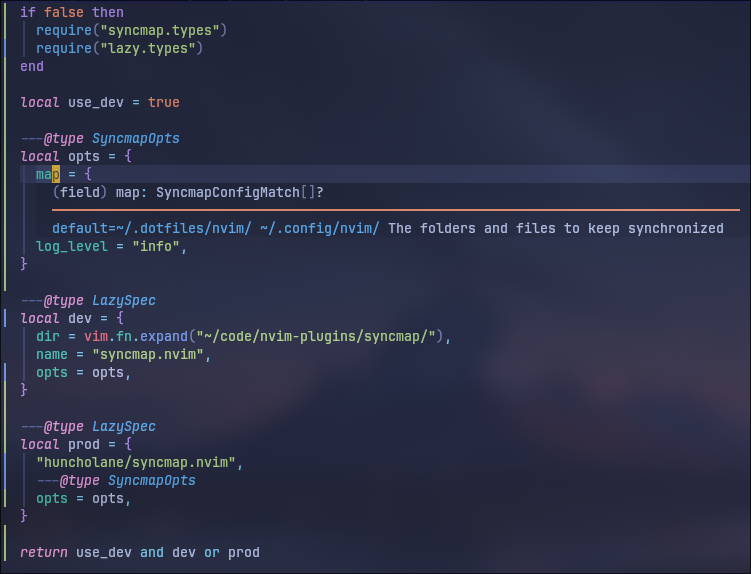

# syncmap.nvim

A lightweight Neovim plugin that keeps directories in sync using `inotifywait`, `rsync`, and some clever Vimscript + Lua integration.

## Motivation

- Dotfiles

## Features

- Automatically sync source → destination directories on file changes
- Uses `inotifywait`, `pgrep`, `pkill`, and `rsync`
- Supports `.gitignore`-like exclusions via `--exclude-from`
- Reverse sync on startup (optional)
- Logs and restarts lost watchers automatically
- Fully typed config for autocompletion and inline docs

## Requirements

- Linux (uses `inotifywait`)
- Neovim 0.8+
- Tools:
  - `inotifywait` (from `inotify-tools`)
  - `rsync`
  - `pgrep` and `pkill` (from `procps-ng`)

## Installation

Using [lazy.nvim](https://github.com/folke/lazy.nvim):

```lua
{
  dir = vim.fn.expand("~/code/nvim-plugins/syncmap/"),
  name = "syncmap.nvim",
  opts = {
    map = {
      { vim.fn.expand("~/.dotfiles/test/"), vim.fn.expand("~/.config/test/") },
    },
    log_level = "info",
  },
}
````

## Default Options

```lua
{
  map = {
    { vim.fn.expand("~/.dotfiles/nvim/"), vim.fn.expand("~/.config/nvim/") },
  },
  reverse_sync_on_startup = true,
  rsync = { "-a", "--delete" },
  log_level = "error",
}
```

## Type Hints

For inline type hints and autocomplete, annotate your `opts` using:

```lua
if false then
  require("syncmap.lazy")
end
---@type SyncmapLazySpec
return {
  "huncholane/syncmap.nvim",
  opts = {
    map = {
      { vim.fn.expand("~/.dotfiles/test/"), vim.fn.expand("~/.config/test/") },
    },
    log_level = "info",
  },
}
```



This gives you full visibility into available options and correct types.

---

### LICENSE

```txt
MIT License

Copyright (c) 2025 Huncho

Permission is hereby granted, free of charge, to any person obtaining a copy
of this software and associated documentation files (the "Software"), to deal
in the Software without restriction, including without limitation the rights
to use, copy, modify, merge, publish, distribute, sublicense, and/or sell
copies of the Software, and to permit persons to whom the Software is
furnished to do so, subject to the following conditions:

The above copyright notice and this permission notice shall be included in all
copies or substantial portions of the Software.

THE SOFTWARE IS PROVIDED "AS IS", WITHOUT WARRANTY OF ANY KIND, EXPRESS OR
IMPLIED, INCLUDING BUT NOT LIMITED TO THE WARRANTIES OF MERCHANTABILITY,
FITNESS FOR A PARTICULAR PURPOSE AND NONINFRINGEMENT. IN NO EVENT SHALL THE
AUTHORS OR COPYRIGHT HOLDERS BE LIABLE FOR ANY CLAIM, DAMAGES OR OTHER
LIABILITY, WHETHER IN AN ACTION OF CONTRACT, TORT OR OTHERWISE, ARISING FROM,
OUT OF OR IN CONNECTION WITH THE SOFTWARE OR THE USE OR OTHER DEALINGS IN THE
SOFTWARE.
```

---
